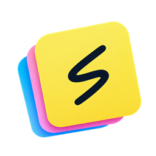
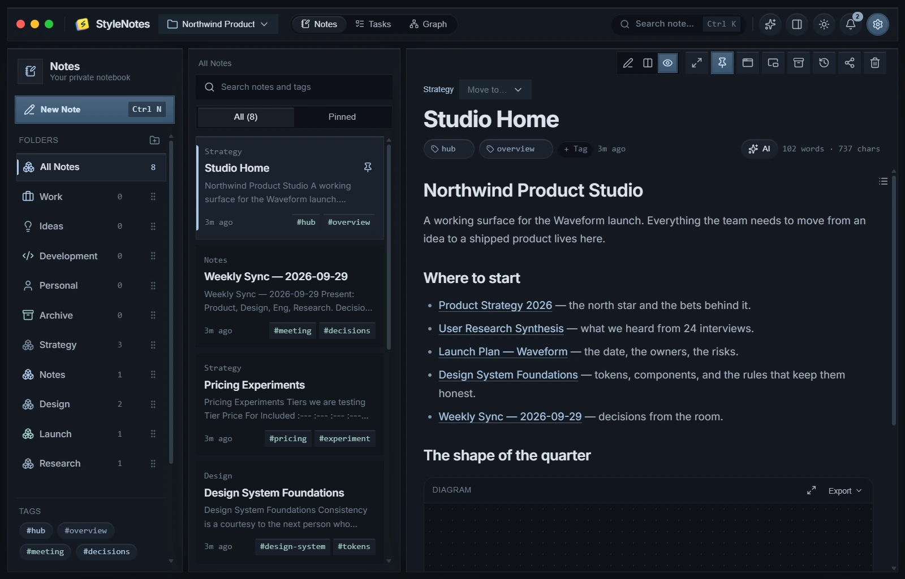
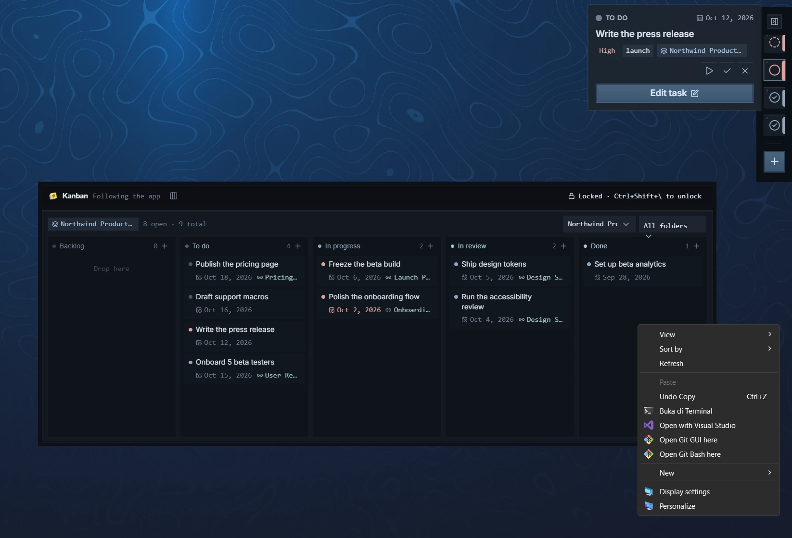
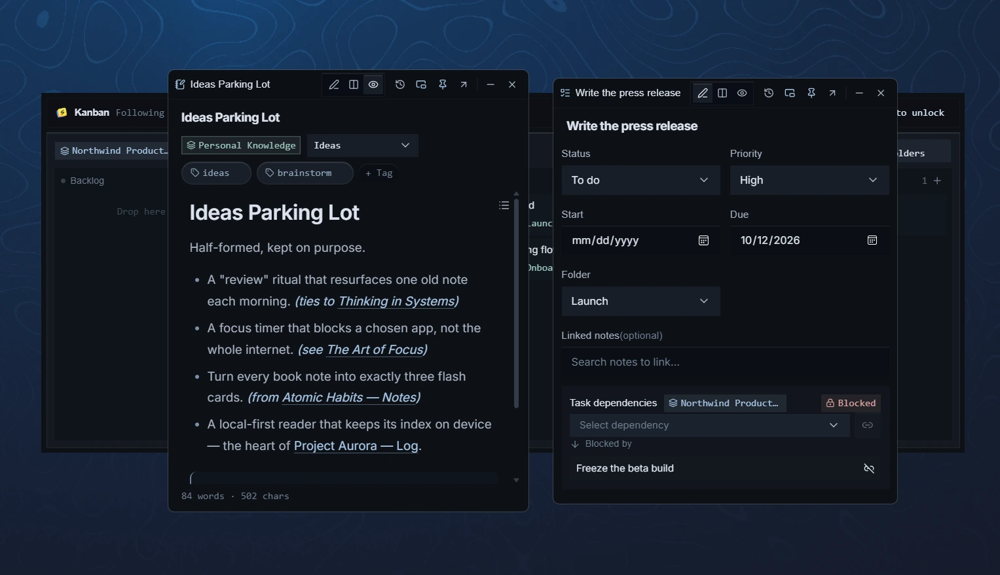
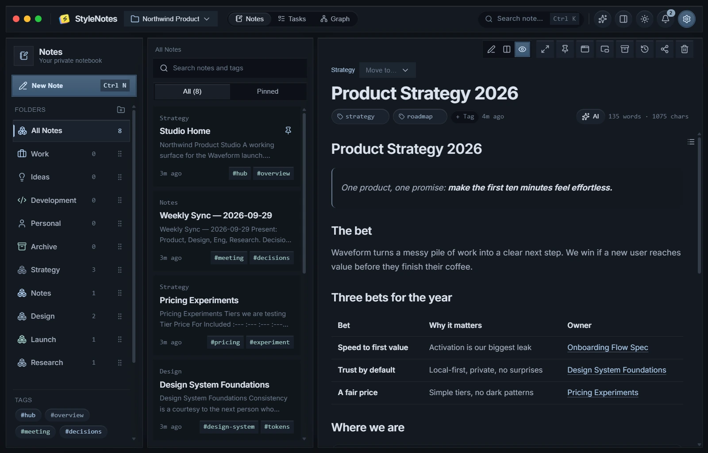
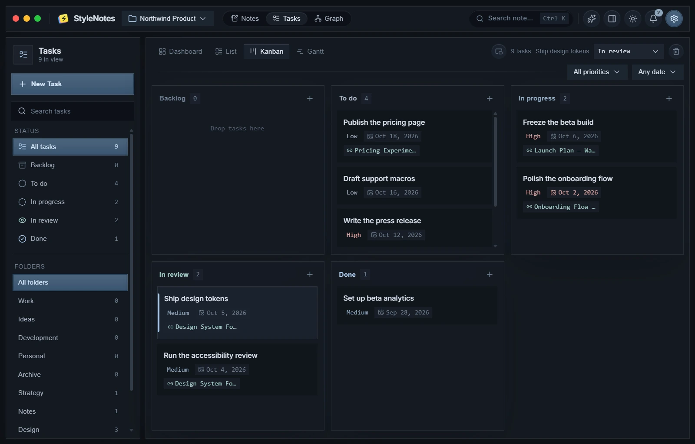
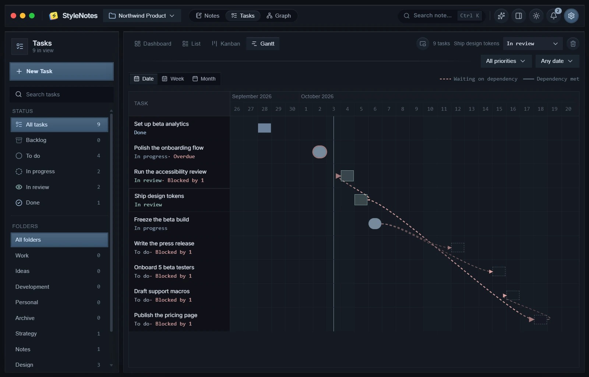
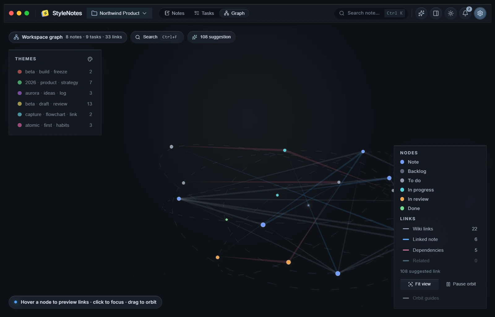
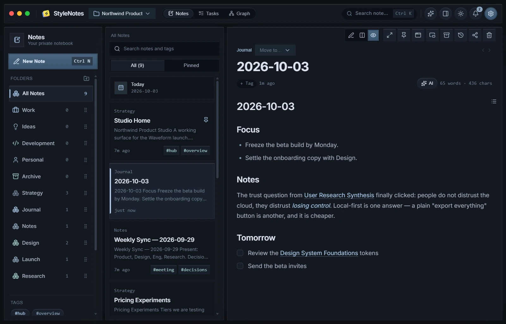
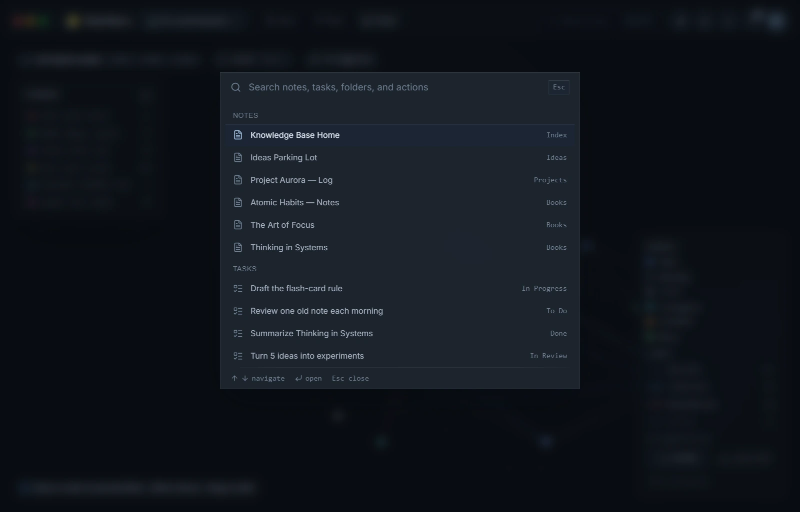

<div align="center">



# StyleNotes

**A calm, private notebook for your ideas, lists, and drafts.**

Markdown notes, tasks, and a graph that connects them — in a fast desktop app that
works entirely offline. No account. No internet required.

[](https://github.com/xFlawlessDev/stylenotes/actions/workflows/ci.yml)
[](https://github.com/xFlawlessDev/stylenotes/releases/latest)
[](https://github.com/xFlawlessDev/stylenotes/releases)
[](LICENSE)

[](https://v2.tauri.app/)
[](https://svelte.dev/)
[](https://www.typescriptlang.org/)
[](https://www.rust-lang.org/)
[](https://vite.dev/)
[](https://tailwindcss.com/)



</div>

StyleNotes keeps everything you write down — and everything you mean to do — in one
local place. Write in plain Markdown and see it rendered live; file notes into
folders and tags; link them with `[[wiki links]]` so ideas connect themselves; and
keep commitments as tasks with due dates, priorities, and dependencies. It is built
with Tauri v2, SvelteKit (Svelte 5), and TypeScript, stores your notes in a local
SQLite database, and ships as a static SPA.

## What it does

- **Notes that are just Markdown.** Write in plain text — headings, tables,
  checklists, blockquotes, code, math, and Mermaid diagrams all render in a live
  preview. Nothing is locked in a proprietary format, and export is plain `.md`.
- **Tasks beside your thinking.** A board for status, a list for focus, a Gantt view
  for what is blocked by what. Link a task to the notes it came from.
- **A graph, not a filing cabinet.** `[[wiki links]]` turn your notes into a map you
  can explore, hover, and search.
- **Search that finds the thought, not just the word.** A command palette (`Ctrl K`)
  jumps to any note, task, or action; full-text search covers titles, tags, and
  bodies. An optional local embedder adds meaning-based recall.
- **Windows that fit how you work.** A full workspace for deep work, an always-on-top
  dock for capture, and a Kanban board that can sit *behind* your other windows as a
  desktop underlay.
- **Capture from anywhere.** `Ctrl+Shift+N` and `Ctrl+Shift+T` open a new note or task
  in a small, always-on-top window — without leaving what you were doing.
- **Yours to make.** Light/dark, accent color, density, reduced motion, and the
  editor layout are all a setting away.

## Built for the desktop

### Floating above, or tucked underneath

The **overlay dock** stays on top of your other apps, so quick access is always one
click away — hover a note or task for a preview, double-click to open its detail
window. When you would rather not be interrupted, the **Kanban board** locks itself to
the desktop as an *underlay*: your tasks follow you behind every window instead of on
top of them. `Ctrl+Shift+\` flips between the two.



### A sticky note, one keystroke away

`Ctrl+Shift+N` drops a new note and `Ctrl+Shift+T` a new task into a small,
always-on-top detail window. Jot the thought down over whatever you were doing — it
saves as you type and is waiting in the workspace next time.



## A look around

| | |
| :---: | :---: |
| <br>**Markdown, rendered live** | <br>**Tasks as a board** |
| <br>**Gantt with dependencies** | <br>**The graph of your notes** |
| <br>**A daily journal page** | <br>**Command palette (Ctrl K)** |

## Your notes, your device

StyleNotes is **local-first by design**. Notes live in a SQLite file on your machine,
the app opens and edits with no connection, and nothing is sent anywhere unless you
explicitly turn on an optional cloud feature. You can point a workspace at a folder
and get a plain-Markdown mirror of it, exported and re-imported automatically, so
your writing is never trapped in the app either.

## Open core

This repository is the **full, free desktop app**. Cloud sync, a hosted AI gateway,
and remote MCP are optional capabilities served by a separate (proprietary) service
— the desktop app is cloud-ready but works completely offline without it.

| Part | License |
| --- | --- |
| The app (`src/`, `src-tauri/`) | [AGPL-3.0-only](LICENSE) |
| The shared protocol (`packages/shared/`) | [MIT](packages/shared/LICENSE) |

`packages/shared` is the sync contract (types, Hybrid Logical Clock, entitlements)
shared with the cloud service. It is deliberately framework-free so third parties can
build their own client or server against the same protocol.

Contributions are welcome under the CLA described in [CONTRIBUTING.md](CONTRIBUTING.md).

## Requirements

- [bun](https://bun.sh/) (package manager)
- [Rust](https://www.rust-lang.org/tools/install) toolchain
- Tauri v2 system dependencies: https://v2.tauri.app/start/prerequisites/

## Getting started

```bash
bun install
bun run tauri dev   # full desktop app (DB, windows, plugins)
```

`bun run dev` starts only the Vite dev server. In a plain browser the SQLite layer is
unavailable and stores fall back to bundled seed notes — use `bun run tauri dev` for
real data.

## Scripts

| Command | Description |
| --- | --- |
| `bun run dev` | Vite dev server only (frontend in browser) |
| `bun run tauri dev` | Full desktop app |
| `bun run build` | Frontend build to `build/` |
| `bun run tauri build` | Production bundle |
| `bun run check` | `svelte-check` typecheck |
| `bun run test` | Vitest unit tests |
| `bun run fmt` / `bun run fmt:check` | `cargo fmt` on `src-tauri` |
| `bun run clippy` | `cargo clippy` with `-D warnings` |
| `bun run check:shared` | Typecheck `packages/shared` (`tsc`) |
| `bun run check:all` | `check` + `check:shared` + `fmt:check` + `clippy` |
| `bun run release` | Cut a release: bump versions, update `CHANGELOG.md`, commit, tag `vX.Y.Z` |
| `bun run release:dry` | Preview the version bump and changelog without changing anything |

## Project layout

```
src/                     SvelteKit frontend
  routes/                +page.svelte branches per window role
  lib/db/                SQLite repos
  lib/stores/            Svelte 5 rune stores
  lib/components/        workspace, overlay, dialogs, ui (shadcn-svelte)
  lib/content/           seed notes + markdown
src-tauri/               Rust backend
  src/lib.rs             Tauri setup, plugins, DB migrations
  tauri.conf.json        window + plugin config
  capabilities/          window permissions
packages/shared/         @stylenotes/shared — sync contract (MIT), shared with the cloud
```

The four window roles all load the same route and branch on the current role:
`workspace` (the full editor), `overlay` (the always-on-top dock), `kanban` (the task
board, lockable to the desktop), and on-demand `note-<id>` / `task-<id>` detail
windows.

See `AGENTS.md` for developer conventions and architecture notes.

## Versioning & releases

Versions follow [Semantic Versioning](https://semver.org/) and are derived
automatically from [Conventional Commits](https://www.conventionalcommits.org/)
(`feat:` → minor, `fix:` → patch, `!` / `BREAKING CHANGE` → major) via
[`commit-and-tag-version`](https://github.com/absolute-version/commit-and-tag-version)
— the maintained successor of the deprecated `standard-version`.

One command keeps **every** version file in lockstep:

| File | Why it matters |
| --- | --- |
| `package.json` | source of truth for the current version |
| `src-tauri/tauri.conf.json` | bundle version + About panel (`appInfo.version`) |
| `src-tauri/Cargo.toml` | Rust crate version |
| `src-tauri/Cargo.lock` | keeps binary builds from a release tag reproducible |

```bash
bun run check:all          # sanity-check before cutting a release
bun run release:dry        # preview bump + changelog, changes nothing
bun run release            # bump all files, update CHANGELOG.md, commit, tag vX.Y.Z
git push --follow-tags      # publish the commit and tag when ready
```

Pushing the tag starts the **Release** workflow (`.github/workflows/release.yml`). It
builds the installers on Windows, macOS (arm64 + Intel), and Linux with
[`tauri-action`](https://github.com/tauri-apps/tauri-action) and publishes the GitHub
Release for the tag:

```bash
git push origin main        # the release commit
git push origin v0.1.0      # the tag — this is what triggers the build
```

The build is **unsigned** for now (no signing certificates are configured): macOS
shows a Gatekeeper warning and Windows a SmartScreen prompt on first launch.
Re-running a failed job rebuilds only that platform and attaches to the same Release.

Things worth knowing:

- **First release:** `bun run release -- --first-release` tags the current version as-is without bumping.
- **Force a bump:** `bun run release -- --release-as minor`. Below 1.0.0 the tool follows the npm/cargo convention — only breaking changes raise the minor, everything else bumps the patch, so plain `feat:` commits go `0.1.0 → 0.1.1`; pass `--release-as minor` if you want `0.2.0`.
- **Never edit versions by hand.** `src/lib/version-sync.test.ts` fails the test suite if the four files drift apart, and custom updaters in `scripts/` rewrite only the version line of each file (formatting, inline arrays, and CRLF line endings are preserved).
- A `postbump` hook runs `cargo update --offline -p stylenotes` so `Cargo.lock` always matches `Cargo.toml`, and the release commit includes it.

## Recommended IDE setup

[VS Code](https://code.visualstudio.com/) + [Svelte](https://marketplace.visualstudio.com/items?itemName=svelte.svelte-vscode) + [Tauri](https://marketplace.visualstudio.com/items?itemName=tauri-apps.tauri-vscode) + [rust-analyzer](https://marketplace.visualstudio.com/items?itemName=rust-lang.rust-analyzer).
