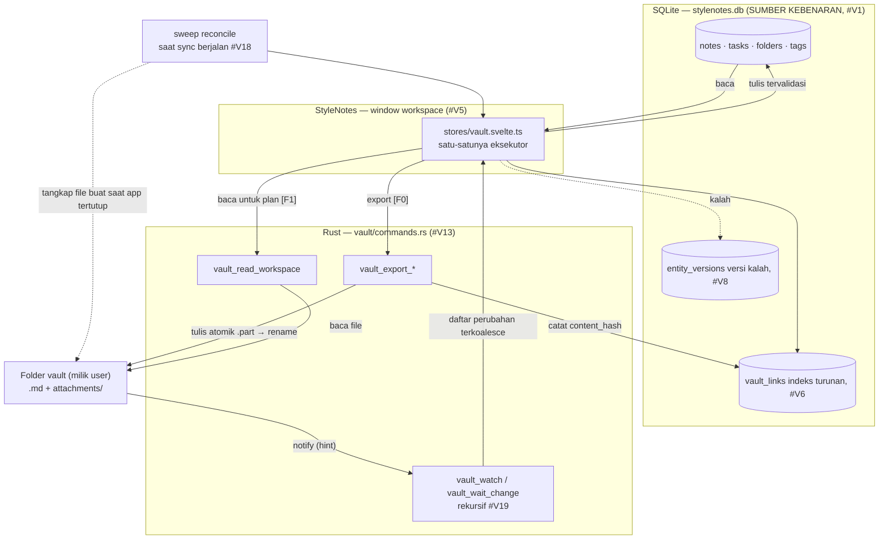
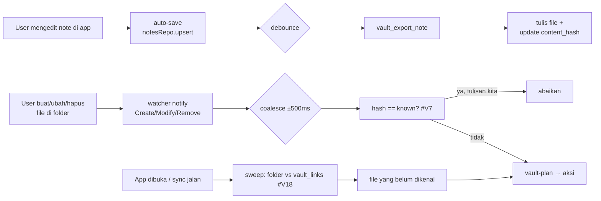
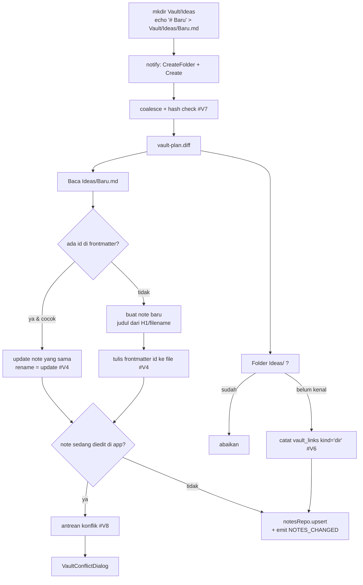
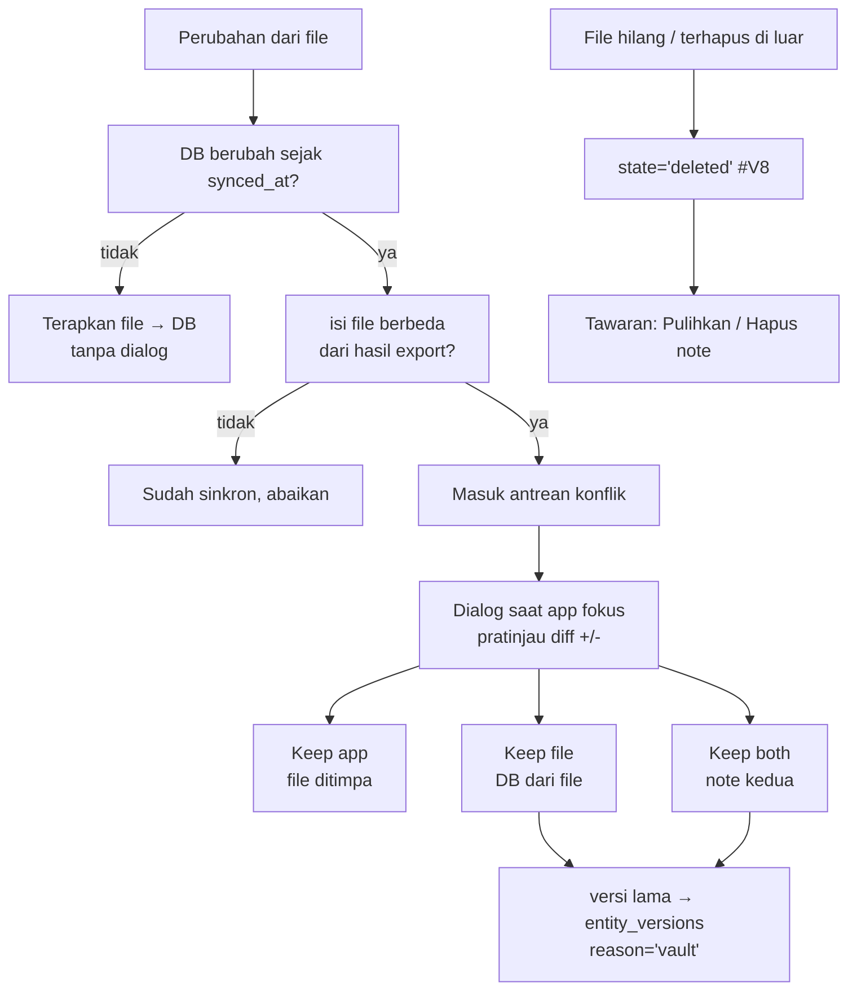
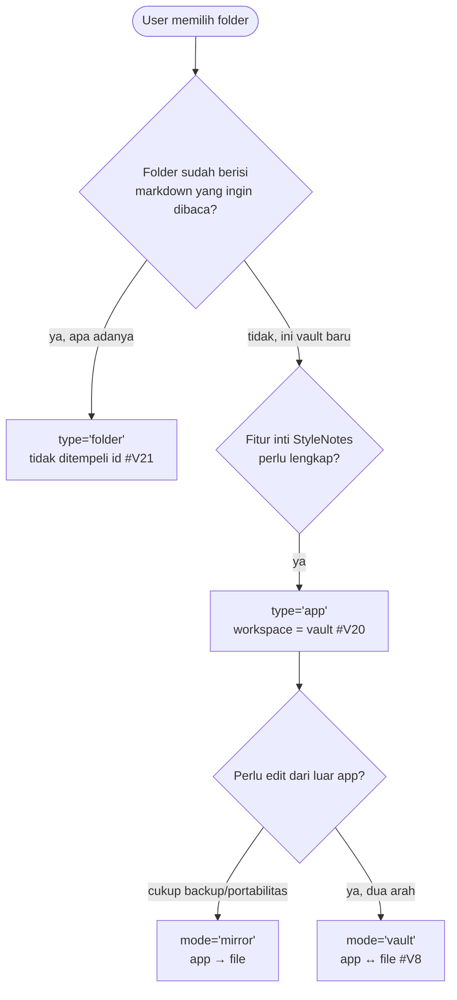
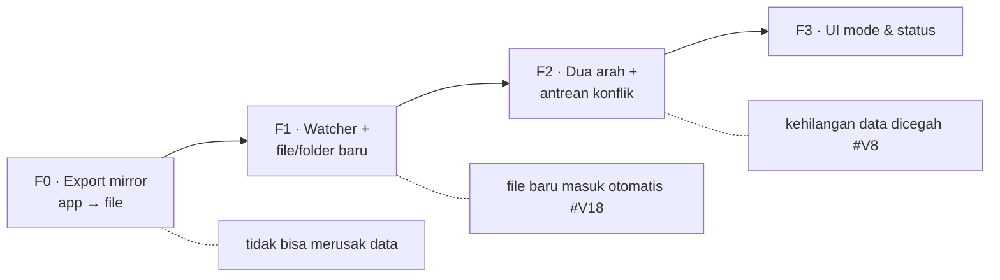
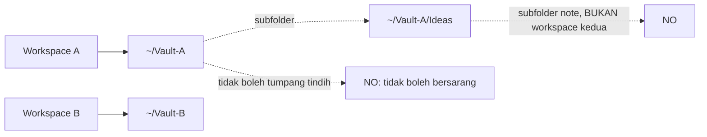

# System Design — Vault Folder (file-over-app, SQLite tetap sumber kebenaran)

> Status: **F0 + impor folder (F1) diimplementasikan** (2026-10-02). Keputusan #V1–#V22 tetap berlaku;
> yang sudah ada di kode: migrasi 25, `src-tauri/src/vault/`, `content/vault-format.ts`,
> `content/vault-plan.ts`, `content/vault-reconcile.ts`, `db/vault.ts`, `stores/vault.svelte.ts`,
> `VaultSettings.svelte`. Watcher otomatis & mode dua-arah (F2–F3) masih desain. Lihat §10–§11.
> Tanggal: 2026-10-02
> Scope: user bisa memilih sebuah **folder workspace** sebagai cermin (mirror) data —
> note, folder, tag, task — dalam bentuk `.md` + `attachments/`, dan memilih apakah
> ia hanya **export** (app → file) atau **dua arah** (app ↔ file). Target platform
> desktop Tauri: **Windows, macOS, Linux** (#V22).
> Dokumen terkait:
> - `docs/design/archive/artifacts.md` — layout blob content-addressed (#A1–#A3), export
>   referensi (#A10), Trash (#A11). Folder vault memakai layout yang sama.
> - `docs/design/archive/constella-features.md` — `markdown-import.ts` (#D14) dan
>   import Rust (`import.rs`). Arah folder → DB memperluas modul itu.
> - `docs/design/archive/mcp-local-free.md` — "satu pintu tulis" (#D2) dan pola
>   tabel → repo(`boolean`) → store `.svelte.ts` (#D3). Watcher mengikuti aturan yang sama.
> - `docs/design/archive/auto-save-versioning.md` — `entity_versions` sebagai jalur pemulihan konflik.
> - the cloud sync design — delta HLC yang **tidak** boleh bersaing dengan file sync pihak ketiga.
> - `AGENTS.md` — aturan file (≤300/500 LOC), i18n, migrasi, satu pintu tulis.

---

## 0. Ringkasan eksekutif

Keinginan "file-over-app" itu sah: user ingin datanya bisa dibaca editor lain, di-backup
git, dan tidak terkurung di satu app. Obsidian menang di sini karena vault-nya **adalah**
folder markdown. Kita tidak bisa meniru itu secara mentah tanpa kehilangan hal yang membuat
StyleNotes lebih kuat (graph, dependency, semantic index, versi) — tetapi kita **bisa**
memberi rasa yang sama tanpa mengorbankan integritas.

**Premis yang mengunci desain ini:**

> SQLite tetap sumber kebenaran. Folder vault adalah **proyeksi** darinya, bukan database kedua.
> `stylenotes.db` **tidak pernah** ditaruh di folder vault.

Alasan #V1 di bawah. Hasilnya: user boleh memilih, per workspace, salah satu dari:

| Mode | Arah | Rasa yang didapat |
|---|---|---|
| **App-only** (default) | — | Seperti sekarang. Nol risiko. |
| **Mirror** | app → folder | "Filenya milik saya": backup, git, portabilitas. |
| **Vault** | app ↔ folder | Edit di VS Code/Obsidian, app tetap pemilik index. |

Prinsip yang membentuk desain:

1. **DB bukan file yang di-sync (#V1).** SQLite single-writer; file sync menyalin `.db` saat
   ditulis → korup. Unit sync kita adalah perubahan entitas (HLC), bukan file.
2. **Identitas dari `id`, bukan judul (#V4).** `id` ditulis di frontmatter, sehingga rename
   file = update, bukan note baru. Ini yang menyelamatkan `[[wikilink]]`.
3. **Satu pintu tulis tetap berlaku (#V5).** Watcher hanya **pemasok**; tidak pernah menulis
   SQLite sendiri. Semua lewat repo/store tervalidasi seperti job bridge MCP.
4. **Konflik dijawab user, bukan ditebak (#V8).** Perubahan yang tidak konflik langsung masuk;
   hanya note yang benar-benar diubah dua sisi yang masuk antrean, dengan pratinjau diff.
5. **Kehilangan data tidak boleh jadi harga (#V9).** File hilang → tombstone + tawaran pulihkan,
   bukan hard-delete. Yang kalah disimpan di `entity_versions`.
6. **Jujur soal yang lossy (#V11).** Graph, dependency, kanban, embedding, klaster, versi
   tidak punya bentuk `.md` yang wajar. Mode vault tidak menjanjikannya.
7. **File kita tetap file orang lain (#V3).** Frontmatter harus YAML sah yang stabil, supaya
   Obsidian/VS Code tidak bingung dan `git diff` tidak berisik.
8. **Watcher adalah petunjuk, sweep adalah jaring pengaman (#V18).** File/folder baru yang
   dibuat user di luar app tetap masuk walau app sedang tertutup atau watcher gagal dipasang;
   folder adalah data turunan dari path, bukan sumber kebenaran (#V12).

---

## 1. Kondisi kode saat ini (temuan yang membentuk desain)

Dibaca dari `src-tauri/src/import.rs`, `mcp_watch.rs`, `db_tx.rs`, `lib.rs`,
`src/lib/content/markdown-import.ts`, `note-actions.ts`, `attachments.ts`,
`src/lib/db/{notes,workspaces,attachments,versions}.ts`, `packages/shared/src/*`.

| # | Temuan | Implikasi ke desain |
|---|--------|---------------------|
| 1 | **Pembaca vault sudah ada.** `import_read_markdown` (`import.rs`) menelusuri folder, men-skip symlink, batas `MAX_FILES = 5_000`, `MAX_FILE_BYTES = 5 MB`, dan mengembalikan `{ path, content }`. | Arah folder → app **tidak butuh walker baru**. Yang ditambah hanya pemanggil otomatis dan watcher. |
| 2 | **Parser frontmatter sudah ada & teruji.** `parseFrontmatter`, `titleForFile`, `folderForPath`, `normalizeTag` (`markdown-import.ts`). | Tidak ada parser YAML baru. Format vault diperluas dari bentuk yang sudah dibaca. |
| 3 | **Export markdown + folder sudah ada.** `exportNoteMarkdown`, `exportNotesToFolder` (`note-actions.ts`) menulis `.md` per note ke subfolder per folder, dan menulis ulang referensi attachment. | F0 (mirror) sebagian besar sudah jadi; ia tinggal dinaikkan dari aksi manual menjadi "mode + jalan berkelanjutan". |
| 4 | **Referensi attachment sudah portabel.** `rewriteAttachmentReferences` menulis `stylenotes-attachment://…` → `attachments/<ab>/<id>.<ext>` (#A10). | Folder vault memakai layout attachments yang **sama persis** dengan S3 object key (#A2). Tidak ada translasi. |
| 5 | **`notify` sudah jadi dependency & sudah dipakai.** `mcp_watch.rs` memakai `RecommendedWatcher`, dengan disiplin: "watcher hanya hint, bukan lease", tidak memblokir main thread. | Watcher vault memakai pola yang sama; tidak ada dependency baru, tidak ada thread yang memblokir UI. |
| 6 | **Write pool Rust sudah ada.** `db_tx.rs` (`note_upsert_tx`, `note_remove_tx`, `workspace_remove_tx`) memakai pool WAL terpisah, satu transaksi per operasi. | Penulisan hasil watcher memakai jalur yang sama; bukan `db.execute` mentah dari frontend. |
| 7 | **`workspaces` sudah per-scope.** `notes`/`tasks`/`folders` punya `workspace_id` (migrasi 8). | "1 workspace = 1 folder vault" adalah pemetaan alami, disimpan sebagai kolom baru di `workspaces`. |
| 8 | **`updated_at` machine-readable sudah ada** (migrasi 12) di `notes`; `tasks.updated_at` masih TEXT menunggu rebuild Fase 0 sync. | Resolusi konflik F1 memakai `updated_at` note; task ditunda sampai skema task distabilkan. Lihat #M8. |
| 9 | **`entity_versions` sudah ada** (migrasi 15) dengan `reason`. | Versi yang kalah saat konflik disimpan di sini, `reason: 'vault'`. Recall sudah ada UI-nya. |
| 10 | **Katalog `attachments` adalah indeks turunan**, bukan truth (#A6), dan blob bisa di-rebuild. | Copy blob ke folder vault bersifat idempotent (hash sama → tidak ditulis ulang). |
| 11 | **Satu pintu tulis dijaga ketat**: `mcp-write-actions.ts` adalah satu-satunya jalur tulis tervalidasi; MCP shim tak pernah buka SQLite. | Watcher **wajib** menyalurkan perubahan ke repo/store yang sama, bukan menulis DB langsung. |
| 12 | **Multi-window, satu proses menulis.** `workspace` selalu hidup (hide-on-close + tray). | Eksekutor sync folder hanya boleh di `workspace`, sama seperti `mcp-host.svelte.ts` (#D16). |
| 13 | **Capabilities sempit & gagal senyap.** `capabilities/default.json` sudah punya `fs:allow-write-text-file`, `fs:allow-mkdir`, `dialog:default`. | Menulis folder terpilih dari **frontend** butuh scope `recursive`; alternatif lebih aman: I/O folder vault dilakukan **di Rust** (seperti `attachments`), sehingga webview tidak menambah izin filesystem. |
| 14 | **i18n wajib.** Label konflik/mode adalah string user-facing → `t()`; nilai yang dipersistensi (mis. `reason`) tetap English. | Antrean konflik & Settings mode masuk locale. |
| 15 | **Batas file ≤300/500 LOC.** `markdown-import.ts` sudah 194 baris. | Modul baru dipecah sejak awal: `content/vault-format.ts`, `content/vault-plan.ts`, `content/vault-conflicts.ts`, `db/vault.ts`, `stores/vault.svelte.ts`, `src-tauri/src/vault/`. |
| 16 | **Cloud sync belum ada di repo** (hanya seam `cloud-types.ts`/`cloud-client.ts`). | Kita bisa menetapkan aturan eksklusivitas **sekarang**, sebelum dua engine sempat hidup bersamaan. |

**Kesimpulan:** tidak ada blocker arsitektural. F0 adalah pengemasan ulang fitur yang sudah
ada; F1 menambah watcher dengan pola yang sudah terbukti di MCP; F2 menambah resolusi konflik
di atas versioning yang sudah ada.

---

## 2. Arsitektur

```
┌────────────────────────────────────────────────────────────────────────────────┐
│  StyleNotes (satu proses)                                                       │
│                                                                                │
│  ┌─ SQLite: stylenotes.db (SUMBER KEBENARAN, #V1) ─────────────────────────┐  │
│  │  notes · tasks · folders · tags · workspaces · entity_versions          │  │
│  │  vault_links (indeks turunan, #V6)                                      │  │
│  └───────────────┬────────────────────────────────────▲────────────────────┘  │
│                  │ baca (store)                        │ tulis (repo/store)     │
│                  ▼                                     │ tervalidasi (#V5)      │
│  ┌─ Vault writer (Rust, app → folder) ─────────────────┴──────────────────┐   │
│  │  vault_export_note / vault_export_workspace                             │   │
│  │  → <vault>/**/*.md  +  <vault>/attachments/<ab>/<id>.<ext>              │   │
│  │  atomik: *.part lalu rename                                             │   │
│  └───────────────┬─────────────────────────────────────────────────────────┘  │
│                  │ tulis file                                                  │
│                  ▼                                                              │
│  ┌─ Folder vault (milik user) ─────────────────────────────────────────────┐  │
│  │  Idea.md · Projects/Roadmap.md · Tasks/Ship v1.md · attachments/…       │  │
│  └───────────────┬─────────────────────────────────────────────────────────┘  │
│                  │ notify (hint, bukan lease)                                   │
│                  ▼                                                              │
│  ┌─ Vault watcher (Rust, folder → app) ────────────────────────────────────┐  │
│  │  vault_watch / vault_wait_change   ← pola mcp_watch.rs, rekursif (#V19)   │  │
│  └───────────────┬─────────────────────────────────────────────────────────┘  │
│                  │ perubahan mentah terkoalesce (path + kind + mtime)           │
│                  ▼                                                              │
│  ┌─ Vault plan (TS murni, teruji) ─────────────────────────────────────────┐  │
│  │  vault-plan.ts       → baca file → aksi: create|update|delete|conflict  │  │
│  │  vault-conflicts.ts  → bandingkan dua sisi, shape keputusan user        │  │
│  │  vault-format.ts     → frontmatter ⇄ Note/Task                          │  │
│  └───────────────┬─────────────────────────────────────────────────────────┘  │
│                  │ aksi final                                                  │
│                  ▼                                                              │
│  ┌─ Satu pintu tulis (#V5) ────────────────────────────────────────────────┐  │
│  │  stores/vault.svelte.ts → notesRepo/tasksRepo + emit lintas-window      │  │
│  │  (hanya window `workspace`; guard sama seperti mcp-host)                │  │
│  └─────────────────────────────────────────────────────────────────────────┘  │
└────────────────────────────────────────────────────────────────────────────────┘
```

### Komponen baru

| Komponen | Teknologi | Tanggung jawab |
|---|---|---|
| `src/lib/content/vault-format.ts` | TS murni | Frontmatter stabil ⇄ `Note`/`Task`; whitelist field; wikilink verbatim. **Teruji.** |
| `src/lib/content/vault-plan.ts` | TS murni | Bandingkan file vs DB + `vault_links` → daftar aksi. **Teruji.** |
| `src/lib/content/vault-conflicts.ts` | TS murni | Deteksi konflik sebenarnya, bentuk pratinjau diff, pilihan user. **Teruji.** |
| `src/lib/db/vault.ts` | TS | Repo `vault` (binding folder per workspace + `vault_links`), return `boolean`. |
| `src/lib/stores/vault.svelte.ts` | Svelte 5 runes | Orkestrasi: hydrate, export, terapkan hasil watcher, antrean konflik, emit lintas-window. |
| `src/lib/components/workspace/VaultSettings.svelte` | Svelte | Settings: pilih folder, pilih mode, status, tombol export/rebuild. |
| `src/lib/components/workspace/VaultConflictDialog.svelte` | Svelte | Antrean konflik + pratinjau diff + Keep app / Keep file / Keep both. |
| `src-tauri/src/vault/mod.rs` | Rust (murni) | Layout path, nama file aman, deteksi marker konflik git/Dropbox. |
| `src-tauri/src/vault/commands.rs` | Rust (I/O) | `vault_export_*`, `vault_read_*`, `vault_watch`, `vault_wait_change`, `vault_choose_folder`. |
| Tabel `vault_links`, kolom `workspaces.vault_mode`/`vault_path`/`type` | Migrasi 25 | Lihat §V6, §V21. |

---

## 3. Keputusan arsitektur

### V1 — SQLite tetap sumber kebenaran; `.db` tidak pernah di folder vault

| Opsi | Penilaian |
|---|---|
| **A. Taruh `stylenotes.db` di folder vault, sync file-level** ❌ | SQLite single-writer; layanan sync menyalin file saat sedang ditulis → korup. Sync kita berbasis delta entitas, bukan file. Attachment sudah punya object key. |
| **B. Folder vault = cermin DB; DB tetap di `app_data_dir`** ✅ | File `.md` portabel, DB aman. Satu sumber kebenaran. Kompatibel dengan cloud sync (blob key sama). |
| C. DB per workspace di foldernya | Multi-window multi-DB, migrasi terpisah, `tauri-plugin-sql` preload satu URL. Kompleks tanpa manfaat. |

**Keputusan:** B. Dokumen ini menyebut folder sebagai *vault* hanya dalam arti cermin.

### V2 — Tiga mode per workspace, default app-only

```
workspaces.vault_mode ∈ { 'off', 'mirror', 'vault' }   -- default 'off'
workspaces.vault_path TEXT                              -- folder terpilih, null saat off
```

- **`off`** — perilaku hari ini.
- **`mirror`** — app menulis file; watch folder **tidak** aktif. Aman, satu arah.
- **`vault`** — dua arah dengan resolusi konflik (#V8).

Mode disimpan per workspace karena workspace = vault (preseden `journal` §4: "journal itu
per workspace, karena workspace adalah vault"). Ada default global di `settings` untuk
workspace baru.

### V3 — Format file: frontmatter YAML stabil + body markdown apa adanya

```markdown
---
id: 7c2e…-note
title: Roadmap
folder: projects
tags: [plan, q4]
pinned: false
updated_at: 1759452000000
journal_day: 2026-10-02
---

# Roadmap
...body verbatim...
```

Aturan:

1. **Urutan field tetap**, satu field per baris, tanpa mengubah key yang tidak dikenal.
   `id`, `title`, `folder`, `tags`, `updated_at` selalu ditulis; `pinned`, `journal_day`,
   field task hanya saat relevan.
2. **Field tak dikenal dipertahankan** saat menulis ulang (round-trip) — user/plugin Obsidian
   menaruh `aliases`, `cssclasses`, dsb.; menghapusnya akan merusak vault mereka.
3. **Body tidak pernah diubah** oleh penulis: hanya frontmatter yang dikelola app.
4. **`[[wikilink]]` tetap apa adanya.** Parser app sudah memahaminya; tidak ada penulisan ulang.
5. **`id` boleh absen.** File yang dibuat user di luar app tidak wajib punya frontmatter (#V18);
   app mengisinya sendiri saat pertama kali membaca file itu.

### V4 — Identitas dari `id` di frontmatter, bukan judul

| Arah | Cara |
|---|---|
| DB → file | Tulis `id` + `title`; nama file = slug judul (ramah Obsidian), bukan id. |
| File → DB | `id` ada & cocok → **update** note itu, walau path/namanya berubah (rename = update). |
| File → DB | `id` tidak ada (note buatan user di luar app) → buat note baru, tulis `id` ke file. |
| File → DB | Dua file mengklaim `id` sama → konflik (#V8), jangan pilih diam-diam. |

Nama file tetap dari judul (bukan `id.md`) supaya vault enak dibaca manusia dan link Obsidian
tetap bekerja. `id` yang membuat rename aman. Ini menjawab langsung kelemahan vault berbasis judul.

### V5 — Satu pintu tulis: watcher adalah pemasok, bukan penulis

Watcher **tidak** mengeksekusi `INSERT`/`UPDATE`. Ia mengembalikan perubahan ke frontend
(`workspace` window), lalu `stores/vault.svelte.ts` menerapkannya lewat `notesRepo.upsert` /
`tasksRepo` / jalur validasi yang sudah ada (`mcp-write-actions.ts` sebagai preseden). Batasan:

- Hanya window `workspace` menjalankan executor (hidup terus; `note-*`/`task-*` di-destroy).
- Setiap aksi yang berasal dari file **melewati validator yang sama** dengan aksi UI/MCP.
- I/O folder vault dilakukan **di Rust** (`vault/commands.rs`), sehingga webview tidak
  memperluas izin filesystem-nya (temuan #13).

### V6 — `vault_links`: indeks turunan untuk mengetahui apa yang terakhir tersinkron

```
Migration { version: 25, description: "create_vault_binding_and_links" }

ALTER TABLE workspaces ADD COLUMN vault_mode TEXT NOT NULL DEFAULT 'off';
ALTER TABLE workspaces ADD COLUMN vault_path TEXT;
ALTER TABLE workspaces ADD COLUMN type TEXT NOT NULL DEFAULT 'app';   -- 'app' | 'folder' (#V21)

CREATE TABLE IF NOT EXISTS vault_links (
    workspace_id TEXT NOT NULL,
    rel_path     TEXT NOT NULL,           -- 'Projects/Roadmap.md'
    entity_kind  TEXT NOT NULL,           -- 'note' | 'task' | 'dir'
    entity_id    TEXT,                    -- null saat file belum dipetakan
    content_hash TEXT NOT NULL,           -- hash byte file yang kita tulis/baca terakhir
    file_mtime   INTEGER,
    synced_at    INTEGER NOT NULL,
    state        TEXT NOT NULL DEFAULT 'ok',  -- ok | conflict | deleted | unmanaged
    PRIMARY KEY (workspace_id, rel_path)
);
CREATE INDEX IF NOT EXISTS idx_vault_links_entity ON vault_links (workspace_id, entity_id);
```

`entity_kind = 'dir'` mencatat folder kosong yang dibuat user, supaya ia tidak hilang saat sweep
berikutnya (#V18) dan tidak perlu disimpulkan ulang dari daftar file.

Tabel ini **turunan** (#A6/`embeddings` sebagai preseden): hilang → rebuild dengan membaca
folder. Tidak ada data user yang hanya hidup di sini.

### V7 — Loop umpan balik dicegah dengan `content_hash`

Setiap kali kita menulis file, kita catat `content_hash`-nya di `vault_links`. Saat notifikasi
watcher datang:

1. Baca file, hitung hash.
2. Hash == `vault_links.content_hash` → **abaikan** (ini tulisan kita sendiri).
3. Hash berbeda → perubahan nyata dari luar → jalankan `vault-plan`.
4. Saat menerapkan, tulis ulang `content_hash` agar langkah 2 berikutnya bersih.

Tanpa ini, app dan watcher akan saling memicu tanpa henti. Ini alasan `vault_links` ada lebih
dulu daripada fitur dua arah.

### V8 — Konflik: tanya user, tapi hanya saat benar-benar konflik

"Tanya user per konflik" tidak berarti setiap perubahan luar memunculkan dialog. Aturannya:

| Kondisi | Aksi |
|---|---|
| File berubah, DB tidak berubah sejak `synced_at` | **Terapkan langsung** (file → DB). Tidak ada dialog. |
| DB berubah, file tidak | Export langsung (app → file). Tidak ada dialog. |
| Keduanya berubah **dan** hasilnya berbeda | **Konflik** → masuk antrean, dialog saat app fokus. |
| File hilang, DB masih ada | Tombstone `deleted` di `vault_links` + tawaran "Pulihkan" / "Hapus note". Tidak pernah hard-delete diam-diam. |

Keputusan user per konflik:

- **Keep app** — file ditimpa dari DB.
- **Keep file** — DB diperbarui dari file; versi DB lama disimpan di `entity_versions` (`reason: 'vault'`).
- **Keep both** — note kedua dibuat dari varian file (judul disuffiks), aman untuk dua-duanya.

Dialog menampilkan **pratinjau diff** (baris `+`/`-`), bukan hanya "siapa menang". Antrean
diproses berurutan; app tetap bisa dipakai selagi konflik menunggu.

**Kenapa bukan langsung menang:** "file menang" akan menimpa editan app yang belum sempat
ditulis ke file; "app menang" menghapus editan luar. Keduanya kehilangan data diam-diam —
tepat hal yang membuat user tidak percaya fitur sync.

### V9 — Deteksi file bermasalah: git marker, Dropbox conflicted copy, `.db`

`vault/mod.rs` mengenali pola yang tidak boleh ditelan mentah:

| Pola | Aksi |
|---|---|
| Body mengandung `<<<<<<<` / `=======` / `>>>>>>>` | Tandai `conflict`, jangan tulis DB, munculkan di antrean. |
| Nama seperti `Idea (Arif's conflicted copy 2026-10-02).md` | **Abaikan** (bukan note baru). Catat di log. |
| `*.part`, `.tmp`, `~$*` | Abaikan. |
| `.git/`, `.obsidian/`, `node_modules/` | Tidak di-walk. |
| `.db`, `.sqlite`, `-wal`, `-shm` di folder vault | Larang; tampilkan peringatan di Settings. |

### V10 — Attachment: copy ke folder vault, balik ke store saat masuk

- **Export:** blob yang direferensikan disalin ke `<vault>/attachments/<ab>/<id>.<ext>` dan
  referensi ditulis ulang (sudah ada di #A10). Nama file = hash, jadi dua note berbagi satu file.
- **Import:** referensi `stylenotes-attachment://<id>` di file vault dicocokkan ke store; kalau
  blob belum ada, command `attachment_import_bytes` menambahkannya (dedup by hash).
- **Path lain di markdown** (mis. `` lama) tidak dipindahkan otomatis;
  dibiarkan dan ditandai, agar tidak menyalin file di luar vault tanpa izin.

### V11 — Yang lossy, dinyatakan terbuka

Tidak diproyeksikan ke `.md` dan **tidak diklaim**:

- Edge graph (`wiki`/`dependency`/`link`/`semantic`), `graph_suggestions`, klaster tema.
- Dependency task, posisi kanban/overlay, `task_dependencies`.
- `embeddings`, `mcp_*`, `ai_*`, `ui_plugins`, notification.
- Version history (tetap di DB; `.md` hanya versi terkini).

Task **dasar** (judul, status, priority, due, note link) punya bentuk `.md`; dependency tidak.
UI mode vault menampilkan daftar "fitur X tidak ikut ke file" agar tidak ada harapan palsu.

### V12 — Nama file & folder

- Folder: slug dari label folder (`slugifyFolder`, sudah ada), satu level seperti export sekarang.
  `folder` adalah **turunan dari `rel_path`**, bukan sumber kebenaran: file dipindah antar folder
  di disk → `folder` note ikut berubah, `id` tetap; subfolder baru buatan user menjadi folder
  (#V18).
- File: slug dari judul; bentrok di dalam satu folder disuffiks `-2`, `-3` (`uniqueFileName` sudah ada).
- Dua note berjudul sama di folder berbeda → dua file, tidak masalah.
- Rename judul → file di-`rename` (bukan tulis baru lalu tinggalkan yang lama); `vault_links`
  memperbarui `rel_path`, `id` tetap, link Obsidian ke judul lama akan putus — itu batas wajar
  karena Obsidian sendiri punya masalah yang sama saat rename.

### V13 — I/O di Rust, bukan frontend

Folder vault ditulis lewat command Rust, mengikuti pola `attachments/`:

- `vault_choose_folder` (dialog) → path dikembalikan, disimpan di `workspaces.vault_path`.
- `vault_export_note(workspace_id, note_id)` / `vault_export_workspace(workspace_id)`.
- `vault_read_workspace(workspace_id, recursive)` → `{ path, content, mtime }[]` (memakai walk `import.rs`).
- `vault_watch(workspace_id)` / `vault_wait_change(...)` → pola `mcp_watch.rs`, tapi **rekursif** (#V19).

Keuntungan: webview tidak butuh scope `fs` yang lebih luas, symlink tidak diikuti, dan batas
`MAX_FILES`/`MAX_FILE_BYTES` dipakai ulang.

### V14 — Fase

| Fase | Isi | Bergantung pada |
|---|---|---|
| **F0 — Export mirror** | Mode `mirror`, Settings pilih folder, export semua/kontinu setelah save, `attachments/` ikut, `vault_links` dicatat. | — (kode export sudah ada) |
| **F1 — Watcher satu arah + file/folder baru** | `vault_read_workspace` + watcher rekursif (#V19) + sweep (#V18); file → DB (create/update/delete, file/folder baru masuk otomatis) lewat satu pintu tulis; deteksi marker (#V9). | F0 |
| **F2 — Dua arah + konflik** | Loop suppression (#V7) + antrean konflik (#V8) + `entity_versions`. | F1 |
| **F3 — UI mode + status** | Mode per workspace, indikator status, daftar konflik, tombol rebuild `vault_links`. | F2 |

F0 sengaja bisa dikirim lebih dulu: ia **tidak** bisa merusak data (hanya menulis file) dan
langsung menjawab "saya punya filenya".

### V15 — Batas & keamanan

- Batas ukuran & jumlah memakai `import.rs` (`5 MB`, `5_000` file); file lebih besar dilewati.
- Symlink tidak diikuti (mencegah vault keluar dari folder).
- Nama file diturunkan dari judul, disanitasi terhadap pemisah path & karakter terlarang Windows;
  reserved name, trailing dot/space, dan normalisasi NFC ditangani (#V22).
- Penulisan atomik lewat helper `write_atomic` (`*.part` → `sync_all` → rename, dengan replace
  di Windows) — pola `attachments` diperluas untuk target yang sudah ada (#V22).
- `vault_path` divalidasi: harus ada, bukan root drive, bukan `app_data_dir`, bukan di dalam DB,
  dan tidak bersarang di folder vault lain (#V20).

### V16 — Degradasi berjenjang

- Non-Tauri / browser → mode vault **tidak muncul**, seperti store lain.
- Folder vault hilang/dipindah → status `missing`, fitur menyembunyikan diri, tidak ada error merah.
- Mode `vault` + folder tidak bisa diakses → turun ke `mirror` read-only sampai folder kembali.
- Folder ternyata di-sync pihak ketiga → peringatan eksplisit di Settings (#V9).

### V17 — Anti-overengineering: tanpa CRDT, tanpa daemon kedua

- **Tanpa CRDT.** Konflik diselesaikan per note dengan `updated_at`/HLC + keputusan user.
  Kolaborasi CRDT adalah urusan dokumen lain; mode vault tidak menariknya masuk.
- **Tanpa proses watcher kedua.** `notify` sudah ada; watcher vault mengikuti `mcp_watch.rs`
  ("hint, bukan lease"; wait berdeadline).
- **Tanpa re-index penuh tiap perubahan.** `vault_links` memberi delta; rebuild hanya saat diminta.
- **Tanpa menulis field yang tidak kita pahami.** Frontmatter round-trip, body verbatim.

### V18 — File & folder baru buatan user: masuk langsung, tanpa mengganggu auto-save

Ini kasus yang ditanyakan: user **membuat folder dan menaruh file baru** ke dalam vault.
Penanganannya bertingkat supaya tidak ada pekerjaan yang terbuang dan tidak ada dialog palsu.

**Pemicu masuknya file (dua-duanya, bukan salah satu):**

1. **Reaktif — watcher.** `notify` melaporkan `Create`/`CreateFolder`. Dicoalesce ±500 ms
   (editor menulis file berulang), lalu file baru dibaca dan dipetakan.
2. **Sweep saat sync berjalan.** Setiap kali sync mengambil giliran (app fokus, setelah
   sekumpulan perubahan, atau saat app dibuka), ia melakukan *reconcile*: membandingkan isi
   folder dengan `vault_links`. Ini yang menangkap file yang dibuat **saat app tertutup** atau
   saat watcher gagal dipasang — watcher bukan satu-satunya jalur, sesuai prinsip #V7 bahwa
   notifikasi hanyalah petunjuk.

**File baru tanpa `id`** → note baru dibuat dengan `id` baru; app **menulis kembali** frontmatter
ke file itu sehingga `id` tertanam (#V4). Nama judul diambil dari frontmatter `title` kalau ada,
kalau tidak dari nama file. Isi file **tidak disentuh** selain menambah blok frontmatter di atas.

**Folder baru kosong** → tidak membuat note apa pun. Di app, folder itu muncul sebagai folder
kosong (data turunan dari path, #V12), dan **dipertahankan** meski belum berisi note, supaya
tidak hilang di sweep berikutnya.

**Tidak mengganggu auto-save yang sedang berjalan.** Urutan pemicunya:

```
user menaruh file di folder
  → watcher: Create (hint)
  → debounce ±500 ms
  → baca file → vault-plan
      file baru    → buat note + tulis id (satu pintu tulis, #V5)
      folder baru  → catat folder (turunan path)
      bukan .md    → abaikan, kecuali di attachments/ (lihat #V10)
  → emit NOTES_CHANGED
```

- Jika note yang sama **sedang diedit di app** saat file baru muncul, perubahan file **tidak
  langsung menimpa**; ia masuk antrean konflik (#V8). Ini mencegah menelan editan user.
- Pekerjaan import dilakukan **batch** dan **debounced**, bukan per event, sehingga menaruh 50
  file sekaligus tidak memunculkan 50 dialog atau 50 tulisan tunggal.
- File baru yang isinya hanya frontmatter/tidak valid di-skip dengan alasan, seperti
  `markdown-import.ts` hari ini (`skipped: { reason }`).

**Bukan dependensi baru:** penemuan file tetap lewat walk `import.rs` yang sudah ada; watcher
memakai `notify` yang sudah ada. Yang baru hanya pemanggil otomatis + `vault_links` sebagai
pembanding "apa yang sudah dikenal".

### V19 — Watcher rekursif + memantau folder yang baru dibuat

`mcp_watch.rs` memakai `RecursiveMode::NonRecursive` karena `jobs/` datar. Vault adalah pohon,
jadi watcher vault memakai **`RecursiveMode::Recursive`** di root vault. Dua konsekuensi:

1. **Subfolder yang dibuat setelah watcher terpasang** tetap terpantau di Linux/Windows karena
   watch rekursif pada root menurunkan watch ke anak yang baru muncul. Di macOS (FSEvents)
   juga, karena `notify` memakai watcher per-root yang sama. Kalau ada platform yang tidak
   mempropagasi, sweep #V18 tetap menjadi jaring pengaman.
2. **Banjir event saat export besar** diredam oleh debounce + `content_hash` (#V7): tulisan kita
   sendiri menghasilkan event, lalu diabaikan tanpa menulis DB.

`vault_wait_change` mengembalikan **daftar perubahan yang dikoalesce**, bukan satu event, supaya
frontend tidak perlu memanggil berkali-kali.

### V20 — Satu folder, satu workspace (bukan banyak folder per workspace)

Keputusan yang menjawab langsung kasus "user membuat dir sendiri": kalau sebuah folder boleh
berisi banyak folder independen yang semuanya dipetakan ke satu workspace, maka "workspace" dan
"folder" menjadi dua konsep yang tumpang tindih dan user tidak bisa menebak mana yang benar.

**Keputusan:** satu folder vault = satu workspace, dan **tidak boleh tumpang tindih**.

- Folder vault tidak boleh berada di dalam folder vault lain (dan sebaliknya), dicek dengan
  `canonicalize` saat binding.
- Dua workspace tidak boleh memakai folder yang sama.
- Kalau user ingin beberapa vault terpisah, ia membuat beberapa workspace — itu memang model
  workspace = vault yang sudah dipakai journal (#J §4).
- Folder di dalam vault adalah **subfolder note** (namespace `folder`), bukan workspace kedua.

### V21 — Folder tanpa frontmatter punya mode sendiri

Untuk folder yang **bukan** vault StyleNotes — mis. user ingin memakai StyleNotes untuk membaca
folder markdown biasa — `workspaces.type = 'folder'` mengubah perilakunya:

| Aspek | `type = 'app'` (vault) | `type = 'folder'` (folder biasa) |
|---|---|---|
| Penulisan `id` | Ya, app menulisnya | **Tidak**; app tidak mengubah file kecuali user mengedit di app |
| Frontmatter app | Ditulis penuh | Hanya ditulis untuk field yang memang dibuat di app |
| Rename file | Lewat app (rename terdokumentasi) | Dibiarkan seperti apa adanya |
| Folder | Turunan path | Sumbernya adalah struktur folder user |
| Fitur StyleNotes | Semua | Semua, tapi field yang belum ada diturunkan dari path/nama file |

Mode ini menjawab keinginan "biarkan saya memakai folder saya apa adanya, jangan tempel apa-apa",
tanpa memaksa user memilih antara "semua metadata" atau "tidak bisa dibaca".

### V22 — Cross-platform: Windows, macOS, Linux

Tauri, `notify`, `tauri-plugin-dialog`, dan `tauri-plugin-fs` — semua yang dipakai fitur ini —
sudah cross-platform. Yang perlu disiplin adalah **path, nama file, watcher, dan atomicitas
rename**, karena di situlah perbedaan platform benar-benar menggigit.

**Path & rel_path.** `rel_path` selalu relatif ke root vault dan memakai `/` sebagai pemisah di
dalam database (persis `import.rs` yang sudah `replace('\\', "/")`). Path absolut hanya dibuat
sekali oleh Rust untuk I/O dan tidak pernah masuk frontmatter/markdown. Ini menjaga vault pindah
dari Windows ke macOS tetap utuh.

**Nama file yang aman di tiga OS (#V12).** `markdownBaseName` sudah menyaring `\ / : * ? " < > |`.
Tambahan yang dibutuhkan agar aman di macOS (HFS+/APFS) dan Windows:

- `:` (Windows alternate data stream, macOS Finder menerjemahkannya ke `/`) — sudah disaring.
- Simpan nama yang diakhiri titik atau spasi — Windows membuangnya diam-diam (silent mismatch),
  jadi trailing `.`/spasi dipangkas eksplisit.
- **Nama cadangan (reserved device name) Windows**: `CON`, `PRN`, `AUX`, `NUL`, `COM1..9`,
  `LPT1..9` (dengan atau tanpa ekstensi). Nama judul yang jatuh ke sini diberi prefiks, mis.
  `con.md` → `con-note.md`.
- **Normalisasi Unicode: gunakan form NFC.** macOS menormalkan nama file ke **NFD** (mis. `é`
  jadi `e` + combining accent). Kalau dibiarkan, `café.md` yang ditulis di macOS dan
  `café.md` yang ditulis di Windows bisa terlihat sama tapi dibaca sebagai dua file berbeda —
  persis kelas bug "file terlihat ada tapi tidak terdeteksi". Keputusan: **semua nama file dan
  kunci `vault_links` dinormalkan ke NFC** sebelum dipakai, sehingga hash tabel sama di semua OS.
- **Case sensitivity.** Linux case-sensitive, Windows/macOS umumnya tidak. Pencocokan path di
  `vault_links` memakai kunci yang di-lowercase hanya untuk perbandingan di platform
  case-insensitive; penulisan tetap memakai casing asli user.

**Watcher (#V19).** `notify` memakai backend berbeda per OS (`ReadDirectoryChangesW` di Windows,
FSEvents di macOS, inotify di Linux). Dua konsekuensi:

- Semua backend memakai `RecursiveMode::Recursive` di root vault; subfolder baru tetap terpantau.
- **FSEvents (macOS) melaporkan perubahan per direktori, bukan per file, dan bisa telat**.
  Karena itu penemuan file selalu diikuti `vault_read_workspace`/sweep (#V18) yang membaca
  keadaan sebenarnya, bukan mempercayai event. Prinsip "watcher petunjuk, sweep jaring pengaman"
  yang sudah ada (#V17/#V18) adalah yang membuat perbedaan backend ini tidak terasa.

**Atomicitas rename (#V15).** Pola `*.part` → `rename` yang sudah dipakai `attachments`
(`fs::rename(&tmp, &target)`):

- **Unix (macOS/Linux):** `fs::rename` atomik menimpa target secara atomik, aman untuk watcher.
- **Windows:** `std::fs::rename` **gagal** kalau target sudah ada. Folder vault berisi file
  yang memang sudah ada (update berulang), jadi ini **bukan** jalur `attachments` yang target
  barunya belum ada. Untuk vault, penulisan harus: tulis `*.part` → `fs::rename`; kalau gagal
  karena target ada, hapus target lalu rename (dengan jendela kecil non-atomik), **atau** pakai
  API Windows `ReplaceFileW`/`MoveFileExW` dengan `MOVEFILE_REPLACE_EXISTING`. Keputusan:
  helper `write_atomic` di `vault/mod.rs` menangani perbedaan ini satu kali, dengan jendela
  non-atomik Windows disadari dan dikompensasi `content_hash` (#V7) — kalau crash di jendela
  itu, file `*.part` masih ada dan dibersihkan pada sweep berikutnya.
- **`fsync`.** Sebelum `rename`, `sync_all()` dipanggil supaya isi benar-benar di disk; tanpa ini
  sync cloud/git yang membaca file segera setelah rename bisa membaca isi kosong.

**Line endings.** Frontmatter & body ditulis apa adanya. `git config core.autocrlf` bisa mengubah
CRLF/LF saat commit, dan itu akan terlihat sebagai perubahan hash (#V7) — bukan karena app.
Keputusannya: **tulis LF**, dan `content_hash` dihitung dari byte yang benar-benar ditulis.
Pesan peringatan `core.autocrlf` muncul di Settings kalau repo git terdeteksi.

**Nama folder variabel.** Folder tidak boleh memakai `attachments` (dipakai store) atau nama
reserved Windows; disuffiks seperti `attachments-notes`.

**Ringkas per platform:**

| Platform | Watch backend | Risiko khusus | Mitigasi |
|---|---|---|---|
| Windows | ReadDirectoryChangesW | reserved name, trailing dot/space, rename menimpa gagal | sanitasi nama (#V12), `write_atomic` dengan replace |
| macOS | FSEvents | NFD vs NFC, event per-direktori & telat | normalisasi NFC, sweep selalu |
| Linux | inotify | case-sensitive, batas jumlah watch | `canonicalize` untuk dedup path, `canonicalize` folder (#V20) |

---

## 4. Alur

### 4.1 Export (F0)

```
user pilih folder → vault_choose_folder → workspaces.vault_path + vault_mode='mirror'
  → vault_export_workspace:
      for each note:
        render = vault-format.toMarkdown(note)          (frontmatter + body verbatim)
        render = rewriteAttachmentReferences(render)    (#A10)
        write <vault>/<folder>/<slug>.md  (atomik)
        vault_links.upsert(rel_path, note_id, content_hash)
      for each referenced blob:
        copy <app_data>/attachments/… → <vault>/attachments/…   (skip kalau hash sudah ada)
```

### 4.2 Watch → terapkan (F1)

```
vault_wait_change → [ { path, kind: create|modify|remove|createFolder }, … ]  (dikoalesce, #V19)
  for each path (batch, debounce ±500 ms):
    hash == vault_links.content_hash ?  → abaikan (#V7)
    vault-plan.diff(file, db, vault_links) → aksi[]
        createDir → vault_links.upsert(kind='dir')                         (#V18)
        create   → notesRepo.upsert(note baru, id baru) → tulis id ke file  (#V18)
        update   → notesRepo.upsert(note, updated_at=file)   (rename = update, #V4)
        delete   → tandai vault_links.state='deleted' → tawaran pulihkan/hapus
        conflict → antrean (#V8)
  → emit NOTES_CHANGED lintas window
```

### 4.2b Alur kasus: user membuat dir + file baru ke folder vault (#V18)

```
user, di luar app: mkdir Vault/Ideas && echo "# Baru" > Vault/Ideas/Baru.md
  → notify: CreateFolder(Vault/Ideas), Create(Vault/Ideas/Baru.md)
  → vault_wait_change mengembalikan keduanya (coalesced)
  → vault-plan:
      Ideas/                → createDir, vault_links rel_path='Ideas/' kind='dir'
      Ideas/Baru.md         → tidak ada id → note baru
                              title dari H1/filename, folder dari rel_path ('Ideas')
  → satu pintu tulis (#V5): notesRepo.upsert + tulis frontmatter id ke file (#V4)
  → emit NOTES_CHANGED; feed workspace menampilkan note "Baru" di folder "Ideas"
```

Kalau app tertutup saat user membuat file, sweep #V18 yang menemukannya saat app dibuka.
Kalau file baru bentrok dengan note yang sedang diedit, ia masuk antrean konflik (#V8).

### 4.3 Dua arah (F2)

```
save note (auto-save) → notesRepo.upsert → vault.svelte.ts (debounced)
  → vault_export_note → tulis file + update vault_links.content_hash
      → notifikasi watcher datang → hash cocok → abaikan (#V7)
```

---

## 5. Permukaan yang berubah

### 5.1 Database — satu migrasi (25)

Lihat §V6. Tidak mengedit migrasi lama; `workspaces` bertambah tiga kolom dengan default aman
(`vault_mode='off'`, `type='app'`), sehingga workspace lama tidak berubah perilaku.

### 5.2 Settings

Section **Vault** di Settings (nav terpisah, seperti `MCP`/`Memory`):

- Pilih folder (dialog), status folder, tombol **Export now** / **Rebuild index**.
- Pilih mode per workspace + default global.
- Peringatan: folder yang di-sync Dropbox/OneDrive/git; larangan `.db`; konflik menunggu.
- Daftar fitur yang tidak ikut ke file (#V11).

### 5.3 Command + capability

- Command baru terdaftar di `tauri::generate_handler!` (#V13).
- Karena I/O di Rust, `capabilities/default.json` **tidak** perlu scope `fs` baru di luar
  `fs:allow-write-text-file`/`fs:allow-mkdir` yang sudah ada; `dialog:default` untuk picker.
  Kalau `vault_choose_folder` memakai `tauri-plugin-dialog` dari Rust, tidak ada izin webview baru.

### 5.4 i18n

Semua label mode, status, dan dialog konflik lewat `t()` di `locales/{en,id}/settings.ts` +
`dialogs.ts`. Nilai yang dipersistensi (`reason: 'vault'`, `state`) tetap English.

---

## 6. Risiko & mitigasi

| Risiko | Mitigasi |
|---|---|
| `.db` ikut user taruh di folder sync | Dilarang eksplisit; peringatan; validasi `vault_path` |
| Loop tulis ↔ watcher | `content_hash` (#V7) |
| Kehilangan data saat konflik | Tanya user; yang kalah → `entity_versions` (#V8) |
| File hilang karena git/cleanup | Tombstone + tawaran pulihkan, tidak hard-delete (#V8) |
| Dua engine sync berebut | Aturan eksklusivitas cloud StyleNotes ↔ file sync (#V9, the cloud sync design) |
| Frontmatter jadi sampah diff | Field stabil, round-trip, body verbatim (#V3) |
| Nama file Windows ilegal / path traversal | Sanitasi + validasi `vault_path` (#V15) |
| Beban indexing UI | Batch, debounce, satu window, cancellable (#V5, #V17) |
| Harapan "semua fitur ke file" | Daftar lossy eksplisit (#V11) |
| File/folder baru dibuat user tidak terdeteksi | Watcher reaktif **plus** sweep reconcile saat sync berjalan (#V18) |
| Subfolder baru luput dari watch | Watcher rekursif di root (#V19) + sweep sebagai jaring pengaman |
| Dua workspace memakai folder tumpang tindih | Validasi `canonicalize`; satu folder = satu workspace (#V20) |
| Folder biasa tercemar frontmatter app | `type='folder'` tidak menulis `id` (#V21) |
| Nama file ilegal / reserved / NFD di macOS | Sanitasi nama + normalisasi NFC (#V22) |
| Rename-menimpa gagal di Windows | `write_atomic` dengan replace; `sync_all` sebelum rename (#V22) |

---

## 7. Pertanyaan yang sudah dijawab

| # | Pertanyaan | Jawaban |
|---|---|---|
| Q1 | Bisa folder jadi source data SQL? | **Tidak.** DB tetap sumber; folder adalah cermin (#V1). |
| Q2 | User boleh memilih expose file? | **Ya**, per workspace: `off`/`mirror`/`vault` (#V2). |
| Q3 | Siapa menang saat konflik? | **User**, per konflik, saat app fokus; yang kalah disimpan (#V8). |
| Q4 | Boleh di-sync Dropbox/git? | `.md` boleh; `.db` dilarang; marker konflik dideteksi; dilarang bareng cloud StyleNotes (#V9). |
| Q5 | User membuat dir + file baru langsung ke folder vault? | **Masuk otomatis.** Watcher reaktif + sweep; file tanpa `id` jadi note baru, `id` ditulis ke file; folder kosong dipertahankan; tidak menimpa auto-save yang berjalan (#V18). |
| Q6 | Folder yang sudah ada (bukan buatan app) bisa dipakai? | **Bisa**, dengan `type='folder'`; app membaca apa adanya tanpa menempel `id` (#V21). |
| Q7 | Cross-platform Windows/macOS/Linux? | **Ya.** Tauri/`notify`/plugin sudah lintas platform; yang dijaga ketat adalah nama file (reserved/trailing/NFC), watcher per-OS, dan rename menimpa di Windows (#V22). |

---

## 8. Riwayat keputusan

| # | Keputusan |
|---|---|
| V1 | SQLite tetap sumber kebenaran; `.db` tidak pernah di folder vault |
| V2 | Tiga mode per workspace (`off`/`mirror`/`vault`), default `off` |
| V3 | Frontmatter YAML stabil + body verbatim + round-trip field tak dikenal |
| V4 | Identitas dari `id` frontmatter; rename = update; nama file dari judul |
| V5 | Satu pintu tulis; watcher pemasok, executor di window `workspace` |
| V6 | Tabel `vault_links` sebagai indeks turunan (`content_hash`, `state`) |
| V7 | Loop suppression via `content_hash` |
| V8 | Konflik hanya saat dua sisi berubah; tanya user; kalah → `entity_versions` |
| V9 | Deteksi git marker / Dropbox conflicted copy / `.db`; eksklusivitas dengan cloud sync |
| V10 | Attachment disalin ke folder vault (hash-addressed), balik lewat `attachment_import_bytes` |
| V11 | Fitur lossy dinyatakan terbuka (graph, dependency, kanban, embedding, versi) |
| V12 | Nama file/folder dari judul & label, disuffiks saat bentrok |
| V13 | I/O folder vault di Rust; webview tidak memperluas izin fs |
| V14 | Fase F0 export → F1 watcher → F2 dua arah → F3 UI mode |
| V15 | Batas ukuran/jumlah memakai `import.rs`; atomik `*.part` → rename |
| V16 | Degradasi berjenjang; folder hilang → fitur menyembunyikan diri |
| V17 | Tanpa CRDT, tanpa daemon watcher kedua, tanpa re-index penuh tiap perubahan |
| V18 | File/folder baru buatan user masuk otomatis: watcher reaktif + sweep reconcile; file tanpa `id` jadi note baru dan `id` ditulis ke file; folder kosong dipertahankan; auto-save yang berjalan tidak ditimpa |
| V19 | Watcher vault rekursif di root; `vault_wait_change` mengembalikan daftar perubahan terkoalesce |
| V20 | Satu folder = satu workspace; tidak boleh tumpang tindih (`canonicalize`) |
| V21 | `workspaces.type` `'app'` vs `'folder'`; folder biasa tidak ditempeli `id`/frontmatter app |
| V22 | Cross-platform Windows/macOS/Linux: `rel_path` `/`, nama file disanitasi (reserved name, trailing dot/space, NFC), `write_atomic` menangani rename-menimpa Windows, `sync_all` sebelum rename, LF |

---

## 9. Diagram alur fungsional

Bagian ini adalah ringkasan visual keputusan di atas: satu peta besar, tiga alur pemicu,
alur konflik, dan peta keputusan mode. Semuanya menggambarkan **perilaku akhir F2**, dengan
penanda fase `[F0]`/`[F1]`/`[F2]` di langkah yang belum aktif di fase awal.

### 9.1 Peta besar (siapa menulis apa)



Kalimat kuncinya: **DB tidak pernah menunjuk file sebagai pemiliknya.** Panah dari DB ke
folder adalah *proyeksi*; panah kembali dari folder ke DB adalah *usulan* yang harus lewat
`stores/vault.svelte.ts` (#V5).

### 9.2 Tiga pemicu masuknya perubahan



Jalur B dan C penting: **watcher bisa mati atau app bisa tertutup; sweep selalu jadi jaring
pengaman.** Inilah alasan file yang ditaruh user saat app tidak jalan tetap masuk.

### 9.3 Alur detail: file/folder baru buatan user (#V18)



### 9.4 Konflik & pemulihan (#V8)



### 9.5 Peta keputusan: mode mana yang dipakai? (#V2, #V21)



### 9.6 Urutan fase (#V14)



### 9.7 Satu workspace, satu folder (#V20)



---

## 10. Catatan implementasi F0 (2026-10-02)

F0 (export mirror satu arah) sudah ada di kode. Bagian ini mencatat **apa yang
sebenarnya dibangun** dan **di mana ia menyimpang** dari rencana di atas. Semua
keputusan #V1–#V22 tetap berlaku; yang tercatat di sini hanya detail.

### 10.1 Berkas

| Berkas | Isi |
|---|---|
| `src-tauri/src/vault/mod.rs` | Murni: `safe_rel_path` (anti-traversal), `rel_key`, `hash_bytes`, `write_atomic` (part → sync_all → rename, replace di Windows), `is_skipped_rel`. 6 tes. |
| `src-tauri/src/vault/commands.rs` | I/O: `vault_export_files`, `vault_copy_file`, `vault_read_files`, `vault_scan`, `vault_validate_root`. 3 tes. |
| `src-tauri/src/lib.rs` | Migrasi **25** (`vault_links`, kolom `vault_mode`/`vault_path`/`type` di `workspaces`); command terdaftar di `generate_handler!`. |
| `src/lib/content/vault-format.ts` | Murni: `vaultSegment` (reserved name, trailing dot/space, NFC), `vaultFolderSegment`, `vaultRelPath`, `renderVaultNote`, `parseVaultNote`. |
| `src/lib/content/vault-plan.ts` | Murni: `planExport` (nama bentrok → sufiks), `attachmentRelPath`. |
| `src/lib/content/vault-format.test.ts` | 20 tes untuk kedua modul murni di atas. |
| `src/lib/db/vault.ts` | Repo binding + `vault_links` (return `boolean`/jumlah gagal). |
| `src/lib/stores/vault.svelte.ts` | Orkestrasi: hydrate, pilih folder, mode, `exportVault`. |
| `src/lib/components/workspace/VaultSettings.svelte` | Section **Vault** di Settings. |
| i18n | `locales/{en,id}/settings.ts`: `nav.vault` + `settings.vault.*`. |

### 10.2 Penyimpangan dari rencana

- **Dua command export, bukan satu.** `vault_export_files` menulis note (frontend
  yang merender isinya, karena hanya TS yang punya parser markdown penuh), dan
  `vault_copy_file` menyalin blob attachment dari store. Memilih satu command
  besar berarti menyerahkan rendering markdown ke Rust, yang akan menduplikasi
  format di dua bahasa.
- **Tidak ada command pemilih folder Rust.** Dialog tetap di frontend
  (`plugin-dialog`); validasi folder (`vault_validate_root`) yang di Rust. Ini
  menghindari izin baru sementara pengecekan overlap (#V20) tetap di sisi yang
  bisa `canonicalize` dengan benar. (Rencana #V13 menyebut `vault_choose_folder`
  sebagai command; hasil akhirnya setara, hanya letak dialognya.)
- **`write_atomic` menghapus target di Windows sebelum rename** alih-alih
  memanggil `MoveFileExW`. Alasan: menghindari FFI `windows` baru; jendela
  non-atomiknya diterima dan dikompensasi `content_hash` (#V7), persis seperti
  yang diizinkan #V22.
- **`vault_links` belum dipakai untuk loop suppression.** Di F0 hanya satu arah,
  jadi tidak ada loop; kolom `content_hash` sudah diisi dan siap dipakai di F2.
- **Task belum ikut diekspor.** Task adalah F-lanjutan; F0 memproyeksikan note.

### 10.3 Yang belum (F1–F3)

- F1: watcher rekursif (`notify`) + `vault_wait_change`; **impor folder → DB sudah ada** (§11).
- F2: loop suppression otomatis, antrean konflik, `entity_versions` (impor manual sudah menyimpan versi).
- F3: mode `vault` dua arah di UI (kini hanya `off`/`mirror`), status/konflik UI.

### 10.4 Verifikasi

- `bun run check` — 0 error.
- `bun run fmt:check` — bersih.
- `bun run clippy` (`-D warnings`, `--all-features`) — bersih.
- `cargo test --no-default-features vault` — 9/9 lulus.
- `vitest` `vault-format.test.ts` — 20/20 lulus.

---

## 11. Catatan implementasi F1 (impor folder → app)

Bagian kedua yang sudah ada: membaca folder kembali ke app, **secara eksplisit dan
aman**. Ini bukan watcher (itu F1 penuh yang menunggu); ini reconcile yang
dijalankan saat user memintanya, memakai blok yang sama dengan watcher nanti.

### 11.1 Alur

```
Settings → Vault → “Read from folder”
  → vault_scan(root, recursive)            (Rust, hash tiap berkas)
  → planSync(files, notes, vault_links)    (murni, teruji)
      skip: hash sama (#V7) · marker konflik · conflicted copy · berkas kosong
      create: berkas tanpa id → note baru, lalu id ditulis balik ke berkas
      update: id dikenal → note diperbarui; versi lama → entity_versions
      attachment: blob di attachments/ belum ada → dipanggil ke store (dedup hash)
      orphanLink: berkas hilang → dilaporkan, TIDAK menghapus note
  → persistNote(...) untuk tiap note        (satu pintu tulis yang sama dengan editor)
  → vaultRepo.putMany(link)                  (content_hash baru dicatat)
```

### 11.2 Keputusan yang diambil saat menulis kode

- **Impor bersifat aditif.** Tidak ada jalur yang menghapus note. Berkas yang
  hilang hanya jadi `orphanLink` di laporan, sesuai #V8/#V18.
- **Menimpa selalu menyimpan versi.** Sebelum sebuah note ditimpa dari berkas,
  `captureVersion(..., 'vault')` menyimpan versi app, jadi perubahan luar bisa
  di-undo dari Record History. `VersionReason` bertambah `'vault'`.
- **Berkas kosong tidak mengosongkan note.** Kalau berkas yang pernah kita tulis
  sekarang kosong/terpotong, ia di-skip (`empty`) alih-alih menghapus isi note —
  pilihan aman yang konservatif.
- **`vault_import_attachment` membaca hanya `attachments/`.** Path divalidasi dan
  dibatasi ke subtree itu, jadi `rel_path` yang dibuat jahat tidak bisa menarik
  berkas sembarang ke store. Byte-nya masuk lewat `import_bytes` yang sama dengan
  paste clipboard, jadi layout & dedup identik.
- **`orphanTolerant` untuk `type='folder'`.** Satu folder fisik bisa dibuka lebih
  dari satu workspace, jadi link yang note-nya tidak ada di workspace *ini* tidak
  dilaporkan sebagai orphan (#V21).
- **Bukan watcher.** Belum ada `notify`; reconcile dipicu tombol. Saat watcher
  ditambahkan, ia memanggil fungsi yang sama, sehingga tidak ada logika ganda.

### 11.3 Berkas F1

| Berkas | Isi |
|---|---|
| `src/lib/content/vault-reconcile.ts` | Murni: `planSync`, deteksi konflik (`hasConflictMarkers`, `isConflictedCopy`), `isAttachmentPath`. |
| `src/lib/content/vault-reconcile.test.ts` | 13 tes. |
| `src-tauri/src/vault/commands.rs` | `vault_import_attachment`; `VaultFile.content_hash`. |
| `src-tauri/src/attachments/commands.rs` | `import_bytes` diekstrak supaya vault dan clipboard-paste berbagi store. |
| `src/lib/stores/vault.svelte.ts` | `reconcileVault()`. |
| `src/lib/components/workspace/VaultSettings.svelte` | Tombol **Read from folder** + ringkasan. |
| `src/lib/content/version-types.ts` | `VersionReason` bertambah `'vault'`. |

### 11.4 Verifikasi F1

- `cargo test --no-default-features --lib` — **178/178** lulus.
- `vitest vault-reconcile.test.ts` — 13/13 lulus.
- `bun run clippy` (`-D warnings`, `--all-features`) — bersih; `fmt:check` bersih.
