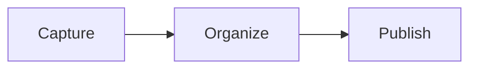

# Welcome to StyleNotes

This note is a live example. Everything below is written in plain Markdown and rendered in **Preview** — switch views from the toolbar, then click, tick, and edit anything you like.

## Text

Style words with **bold**, *italic*, ~~strikethrough~~, and `inline code`. Add a [link](https://example.com) to the web, or type a bare URL like https://example.com and it links itself.

## Lists

### Bulleted

- A plain item.
- An item with **emphasis** and `code`.
  - A nested item, indented by two spaces.

### Numbered

1. First step.
2. Second step.
3. Third step.

### Checklist

- [x] A task that is already done.
- [ ] A task still waiting.
- [ ] Tick a box in Preview and the Markdown updates itself.

#### Tip

`Ctrl+Enter` toggles the checklist item under the cursor.

## Quote

> A note is never lost. It is only waiting for the right moment to be found.
>
> A quote can run for more than one line.

## Table

| Format | What it does | Shortcut |
| :--- | :--- | ---: |
| **Bold** | Strong emphasis | `Ctrl+B` |
| *Italic* | Light emphasis | `Ctrl+I` |
| `Code` | Code inside a sentence | `Ctrl+E` |

## Code

```ts
type Note = {
  title: string;
  tags: string[];
};

export function isPinned(note: Note): boolean {
  return note.tags.includes('pinned');
}
```

## Diagram



## Math

Inline math stays inside the sentence: $E = mc^2$.

$$
\int_0^1 x^2 \, dx = \frac{1}{3}
$$

## Links between notes

A wiki link points at another note by title: [[Welcome to StyleNotes|this very note]], or straight to a heading with [[Welcome to StyleNotes#Lists|jump to Lists]]. Wrap the same link in an exclamation mark (`![[Note title]]`) to embed that note here instead.

---

## Image


